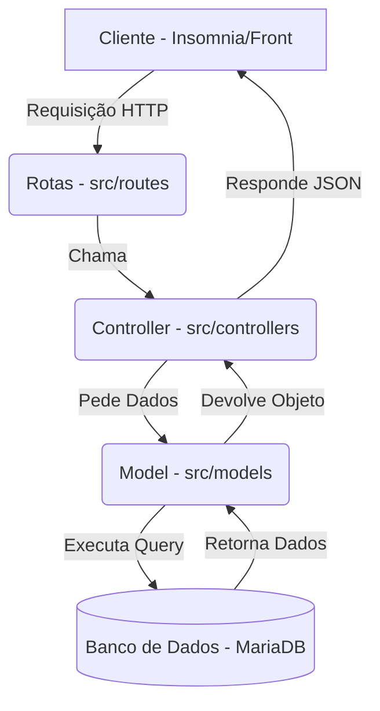

# Guia de Estudos - API Rest de Alunos

Este guia foi criado para ajudar você a **reaprender**, passo a passo, como funciona cada pedaço desta API que construímos.

---

## 1. O Que é e Qual a Arquitetura?

Esta é uma **API RESTful** feita com **Node.js** e **Express**.
Ela segue a arquitetura **MVC (Model - View - Controller)**, mas adaptada para API (onde a View é JSON).

### O Desenho da Arquitetura



---

## 2. Peças Fundamentais (O Código Explicado)

### A. O Coração: `src/app.js` e `src/server.js`
Tudo começa aqui.
*   **server.js**: É a "ignição". Ele apenas importa o `app` e manda escutar na porta 3001. Apenas isso.
*   **app.js**: É a "fábrica".
    1.  Cria a aplicação Express (`this.app = express()`).
    2.  Configura os **Middlewares** (como ler JSON e aceitar x-www-form-urlencoded).
    3.  Chama as **Rotas**.

### B. O Banco de Dados: `src/config` e `src/database`
Não escrevemos SQL na mão. Usamos **Sequelize** (um ORM).
*   **config/database.js**: Tem a senha, usuário e nome do banco.
*   **database/index.js**:
    *   Lê as configurações.
    *   Conecta ao banco (`connection = new Sequelize(...)`).
    *   Carrega cada Model (`User.init(connection)`).
    *   **Importante**: Se um model tiver relações (como Aluno tem Fotos), ele roda o método `associate` aqui.

### C. Models (`src/models/`)
O Model é o espelho da tabela do banco.
Exemplo: `User.js`.
*   Ele define os campos (`nome`, `email`, `password_hash`).
*   Ele tem regras de validação (ex: `msg: 'E-mail inválido'`).
*   **Hooks (Ganchos)**: No `User.js`, usamos `beforeSave` para encriptar a senha (gerar o hash) antes de salvar no banco. **Segurança pura!**

### D. Controllers (`src/controllers/`)
É o "chefe" da lógica. Ele não mexe no banco diretamente (pede pro Model) e não sabe lidar com HTTP (recebe do Express).
Exemplo: `UserController.js`.
*   **store**: Cria usuário.
*   **index**: Lista todos.
*   **update**: Atualiza.
*   **delete**: Apaga.

> **Detalhe importante no Update/Delete**: Eles usam `req.userId`. De onde vem isso? Do Middleware de login (explico abaixo).

### E. Rotas (`src/routes/`)
São os "endereços" do site.
*   Arquivo `userRoutes.js`:
    ```javascript
    router.post('/', userController.store); // Qualquer um pode criar conta
    router.put('/', loginRequired, userController.update); // Só logado
    ```
    Note o `loginRequired` no meio. Ele é o porteiro.

---

## 3. A Autenticação (O Pulo do Gato)

Como sabemos quem é o usuário?

1.  **Login (`TokenController`)**:
    *   O usuário manda email/senha.
    *   O sistema verifica se a senha bate.
    *   Se bater, gera um **Token JWT** (um código louco criptografado) que tem validade (ex: 7 dias).

2.  **O Porteiro (`middlewares/loginRequired.js`)**:
    Todas as rotas protegidas passam por aqui antes de chegar no Controller.
    *   Ele pega o `authorization` do cabeçalho.
    *   Limpa a string (tira a palavra "Bearer").
    *   Tenta decriptar o Token.
    *   **Sucesso?** Ele descobre o ID e o Email do usuário dentro do token.
    *   **Mágica**: Ele coloca `req.userId = id` e `req.userEmail = email`. Assim, o Controller lá na frente sabe exatamente quem está logado sem precisar consultar o banco de novo para senha.

---

## 4. Passo a Passo: Criando um Aluno

Vamos simular o que acontece quando você cria um aluno no Insomnia:

1.  **Requisição**: `POST /alunos` com JSON `{ "nome": "Lucas", ... }` e o Token no Header.
2.  **Rota (`alunoRoutes.js`)**: Recebe. Vê que tem `loginRequired`.
3.  **Middleware**: Confere o token. Válido? Adiciona `req.userId` e manda seguir (`next()`).
4.  **Controller (`AlunoController.store`)**:
    *   Recebe `req.body`.
    *   Chama `Aluno.create(req.body)`.
5.  **Model (`Aluno.js`)**:
    *   Valida os dados (Nome tem tamanho certo? Email é email?).
    *   Se ok, manda SQL pro banco.
6.  **Banco**: Salva e devolve o ID gerado.
7.  **Controller**: Recebe o aluno criado e devolve `res.json(alunoNovo)`.

---

## 5. Comandos Úteis

Para não esquecer os comandos do Sequelize e NPM:

*   **Rodar o projeto**: `npm run dev`
*   **Criar migration (tabela)**: `npx sequelize migration:create --name=nome-da-tabela`
*   **Rodar migrations (aplicar no banco)**: `npx sequelize db:migrate`
*   **Desfazer última migration**: `npx sequelize db:migrate:undo`
*   **Criar Seeds (dados falsos)**: `npx sequelize seed:generate --name=criar-usuarios`
*   **Rodar Seeds**: `npx sequelize db:seed:all`
